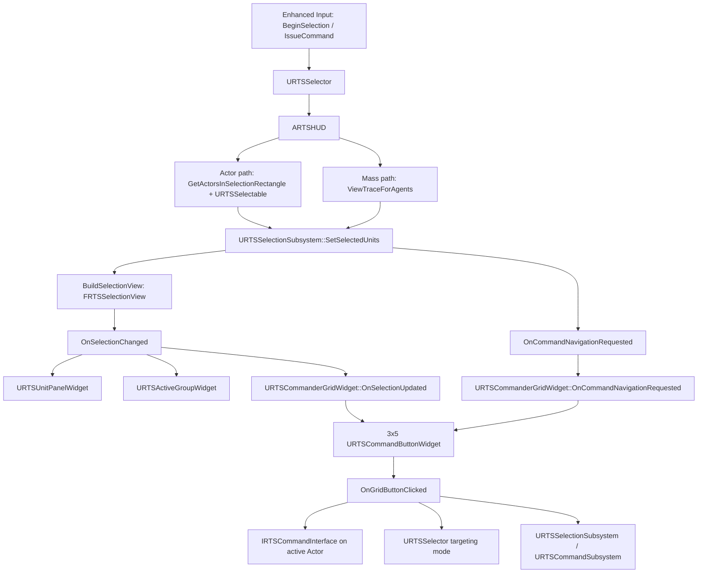
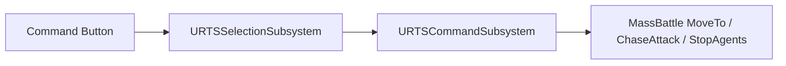

# RTS 选择面板逻辑梳理

本文只梳理当前 `RTS Input System` 里和“选择面板”相关的运行逻辑。范围包括：

- 鼠标点选、框选、Shift/Ctrl 修饰键。
- Actor 与 Mass Entity 两条选择路径。
- `URTSSelectionSubsystem` 如何生成 UI 快照。
- 选择面板、头像面板、命令卡如何响应选择变化。
- 当前实现里最容易混乱和最需要收敛的地方。

不展开相机移动、小地图绘制、HashGrid 建造预览的细节，只在它们影响选择或命令面板时提到。

## 一句话结论

当前逻辑的真正数据源是 `URTSSelectionSubsystem`，但输入、Actor 高亮、选择 UI、头像 UI、命令卡、命令执行各自又保留了自己的状态或兜底路径，所以读起来像几套系统叠在一起。

理想理解方式：

1. `URTSSelector` 只负责输入。
2. `ARTSHUD` 负责把屏幕选择框转换成 Actor/Mass 选择结果。
3. `URTSSelectionSubsystem` 保存最终选择状态，并生成 `FRTSSelectionView`。
4. `URTSUnitPanelWidget` 和 `URTSActiveGroupWidget` 只消费 `FRTSSelectionView`。
5. `URTSCommanderGridWidget` 根据当前选择切换命令卡，并把按钮点击转成 Actor 或 Mass 命令。

实际代码里，第 4、5 步有重叠，第 5 步有两条导航广播路径，这是混乱的主要来源。

## 当前数据流



关键点：`URTSCommanderGridWidget` 同时听 `OnSelectionChanged` 和 `OnCommandNavigationRequested`，所以一次选择变化可能让命令卡刷新两次。

## 核心数据结构

代码位置：

- `Source/OpenRTSCamera/Public/RTSSelectionStructs.h`
- `Source/OpenRTSCamera/Public/RTSSelectionSubsystem.h`
- `Source/OpenRTSCamera/Private/RTSSelectionSubsystem.cpp`

### `FRTSUnitData`

这是选择面板显示一个单位或一类单位摘要的统一结构。

主要字段：

- `Name`：显示名。
- `GroupKey`：稳定分组键。为空时用 `Name` 兜底。
- `Icon`：头像或图标。
- `Count`：单个单位为 1；摘要模式下表示该组数量。
- `Health / Energy / Shield`：状态条数据。
- `bIsMassEntity`：区分 Actor 和 Mass Entity。
- `ActorPtr`：单个 Actor 的回指针。
- `EntityHandle`：单个 Mass Entity 的回指针。

注意：`ActorPtr` 和 `EntityHandle` 只在 `Count == 1` 时语义清晰。摘要项一般只代表组，不代表具体单位。

### `FRTSSelectionView`

这是广播给 UI 的快照。

主要字段：

- `Mode`：`Single`、`List`、`Summary`。
- `SingleUnit`：单选详情。
- `Items`：列表或摘要项。单选时也会放入一个 item。
- `ActiveGroupKey`：当前 Tab 聚焦的分组，用于高亮、头像、命令卡。

`BuildSelectionView()` 里的实际规则：

- 总数为 0：`Mode = Single`，但 `Items` 为空。
- 总数为 1：`Mode = Single`，填 `SingleUnit`，并把同一份数据加入 `Items`。
- 总数 `<= ListModeMaxCount`：`Mode = List`，逐个单位显示。
- 总数 `> ListModeMaxCount`：`Mode = Summary`，按 `GroupKey` 合并计数。

当前 `ListModeMaxCount` 是 16，但枚举注释写的是 `< 12 units`，选择面板默认池子常见又是 12 格。这个数字不统一，是一个真实问题。

## 选择输入逻辑

代码位置：

- `Source/OpenRTSCamera/Private/RTSSelector.cpp`
- `Source/OpenRTSCamera/Private/RTSHUD.cpp`

### `URTSSelector`

`URTSSelector` 是 PlayerController 上的组件，主要职责是绑定输入并把输入转给 HUD 或命令系统。

选择相关流程：

1. `OnSelectionStart()` 读取鼠标屏幕位置，调用 `HUD->BeginSelection()`。
2. `OnUpdateSelection()` 更新鼠标终点，调用 `HUD->UpdateSelection()`。
3. `OnSelectionEnd()` 调用 `HUD->EndSelection()`。

如果当前处于命令瞄准状态：

- 左键不会开始选择，而是把当前点击位置作为命令目标。
- 建造类命令会走 HashGrid 提交。
- `bSkipCurrentSelectionClick` 用来避免一次点击同时执行命令和选择。

右键逻辑在 `OnIssueCommand()`：

- 如果正在瞄准，就用右键落点提交当前 pending command。
- 如果没有瞄准，就执行智能命令：
  - 点到带 `UMassBattleAgentComponent` 的 Actor：发 `RTS.Command.Attack`。
  - 否则对地面发 `RTS.Command.Move`。

### `ARTSHUD`

`ARTSHUD` 负责选择框绘制和最终选择判定。

选择框：

- `BeginSelection()` 保存起点。
- `UpdateSelection()` 保存终点。
- `DrawHUD()` 每帧绘制矩形。
- 只有拖拽距离大于 `MinSelectionSizeSq` 才画框。
- `EndSelection()` 不直接选，而是把 `bIsPerformingSelection` 置为 true，下一次 `DrawHUD()` 调 `PerformSelection()`。

`PerformSelection_Implementation()` 做了几件事：

1. 默认 `Modifier = Replace`。
2. 如果 Shift 按下，先当作 `Add`。
3. Actor 路径：
   - `GetActorsInSelectionRectangle<AActor>()`。
   - 只保留带 `URTSSelectable` 的 Actor。
4. Mass 路径：
   - 调 `PerformMassSelection()`。
   - 点选会扩成 2x2 像素小框，并只保留最近的 1 个结果。
   - 框选保留所有命中的 Mass Entity。
5. Shift + 单点已选目标：
   - 如果点到的单个 Actor 或单个 Entity 已经在当前选择里，改成 `Remove`。
6. Ctrl + 单点：
   - Actor：当前按 Actor Class 选取屏幕内同类 Actor。
   - Mass：按 `FSubType.Index` 选取屏幕内同类 Entity。
7. 最后只调用一次 `URTSSelectionSubsystem::SetSelectedUnits()`。
8. Actor 高亮交给 `URTSSelector::HandleSelectedActors()`。

Mass 选择的底层是 `UMassBattleFuncLib::ViewTraceForAgents()`，屏幕四点按左上、左下、右下、右上的逆时针顺序传入，用来保证视锥平面法线朝内。

## 选择状态与 UI 快照

代码位置：

- `URTSSelectionSubsystem::SetSelectedUnits()`：`Source/OpenRTSCamera/Private/RTSSelectionSubsystem.cpp:201`
- `URTSSelectionSubsystem::BuildSelectionView()`：`Source/OpenRTSCamera/Private/RTSSelectionSubsystem.cpp:282`
- `URTSSelectionSubsystem::BroadcastSelectionViewAndGrid()`：`Source/OpenRTSCamera/Private/RTSSelectionSubsystem.cpp:371`

### `SetSelectedUnits()`

这是选择状态入口。它做的事情比名字多：

1. 过滤无效 Actor。
2. 过滤 `Index == 0` 的 Mass handle。
3. 如果 Actor 带 `UMassBattleAgentComponent`，会把这个 Actor 转成它代理的 Mass Entity，并从 Actor 列表移除。
4. 按 `Replace / Add / Remove` 修改内部状态：
   - Actor 状态存在 `SelectedActors`。
   - Mass 状态存在 `SelectedEntities`。
5. 对 Mass 调 `UMassBattleFuncLib::SelectAgents()` 或 `DeselectAgents()`，更新 Mass 侧选中标记。
6. 调 `BuildSelectionView()`。
7. 调 `BroadcastSelectionViewAndGrid()`。

重要：Mass proxy Actor 会被转成 Entity。这意味着它后续不走 Actor 的 `URTSSelectable` 面板数据，也不走 Actor 自己的命令接口，除非另有桥接。

### `BuildSelectionView()`

它把内部状态转成 UI 快照。

Actor 数据来自：

- `URTSSelectable::SelectionGroupKey`
- `URTSSelectable::Icon`
- `URTSSelectable::Health / Energy / Shield`

如果 Actor 没有 `SelectionGroupKey`，用 Actor class name 或 Actor name 兜底。

Mass 数据来自：

- `FSubType.Index`
- `URTSInputPanelSettings::MassUnitAvatars[Index]`
- 如果配置没有头像，按 subtype seed 加载默认 portrait png。

分组键：

- Actor：`SelectionGroupKey` 优先，否则 class/name。
- Mass：`MassUnit.SubType.xx`。
- 兜底：`MassUnit.Entity.<Index>`。

Active group：

1. 先记住上一次 `CurrentGroupIndex` 对应的 key。
2. 根据 `View.Items` 重新收集 `AvailableGroupKeys`。
3. 排序。
4. 如果旧 key 还存在，保留它。
5. 否则 index clamp 到 0。
6. 写入 `View.ActiveGroupKey`。

这意味着 `ActiveGroupKey` 是按组聚焦，不是按单个单位聚焦。列表模式下，如果多个单位同组，都会被认为 active。

### `BroadcastSelectionViewAndGrid()`

这里有两个广播：

1. `OnSelectionChanged.Broadcast(View)`：所有 UI 面板刷新选择显示。
2. `OnCommandNavigationRequested.Broadcast(NewGrid)`：通知命令卡切到当前选择对应的基础 grid。

命令 Grid 解析规则：

- 如果 `ActiveGroupKey` 对应某个 Actor，并且 Actor 实现了 `IRTSCommandInterface`，取 `GetCommandGrid()`。
- Entity 选择不在这里按 subtype 找 grid，直接走 fallback。
- 如果还有任何 Actor 或 Entity 被选中，并且没有 Actor grid，就用 `DefaultEntityGrid`。
- `DefaultEntityGrid` 没配置时，初始化阶段创建一个 transient `URTSUnitCommandGrid`，提供移动、攻击、停止、驻守、巡逻。

这个函数先广播 Selection，再广播 Grid。命令卡同时监听两者，所以顺序会造成一次选择变化刷新两次命令卡。

## 选择面板 UI

代码位置：

- `Source/OpenRTSCamera/Public/UI/RTSUnitPanelWidget.h`
- `Source/OpenRTSCamera/Private/UI/RTSUnitPanelWidget.cpp`
- `Source/OpenRTSCamera/Public/UI/RTSUnitIconWidget.h`
- `Source/OpenRTSCamera/Private/UI/RTSUnitIconWidget.cpp`

### `URTSUnitPanelWidget`

这是主 UnitPanel 后端，绑定 `URTSSelectionSubsystem::OnSelectionChanged`。

构造时做模板解析：

1. 读取 `IconContainer`。
2. 如果是 `UGridPanel`，优先从 `RowFill / ColumnFill` 推断容量。
3. 否则扫描 Designer 里放的子控件，推断 icon class 和 grid 行列。
4. 清空 Designer 模板。
5. 解析 `IconWidgetClass`：
   - Designer 子控件。
   - `UnitIconClass`。
   - 硬编码 fallback：`/Game/UI/HeadUpDisplay/UnitDetails/Unit.Unit_C`。
6. 按 `MaxRows * MaxColumns` 创建固定数量的 `URTSUnitIconWidget` 池。

刷新逻辑在 `RefreshGrid()`：

- 没有任何选择：
  - 隐藏选择面板。
  - 隐藏外部 `RTSAvatar`。
- 单选，且绑定了 `SingleUnitDetail` 或 `UnitDetailSingle_View`：
  - 显示详情视图。
  - 更新 `SingleUnitIcon`、头像、名字、状态条。
  - 不填 grid。
- 多选或没有单选详情：
  - 显示 grid。
  - 找 `ActiveGroupKey` 对应 item 作为外部头像数据。
  - 遍历 icon pool，把 `Items` 从 0 开始塞进去。
  - 超过 pool 数量的 item 不显示，目前没有分页。

`RefreshLinkedAvatar()` 会在 owning hierarchy 里找名字叫 `RTSAvatar` 的控件，并直接改它的可见性和 `AvatarImage`。这是隐式耦合：不是 BindWidget，也不是显式参数。

### `URTSUnitIconWidget`

每个 icon item 负责：

- `InitData()`：设置图标、状态条、tooltip，并保存 `StoredData`。
- `SetIsActive()`：active 时 opacity 1.0，inactive 时 opacity 0.3。
- 鼠标左键：
  - Shift：`RemoveUnit(StoredData)`。
  - Ctrl：`SelectGroup(GroupKey)`。
  - 普通点击：
    - 如果 `Count > 1`，按组选择。
    - 否则只选择该 Actor 或 Entity。

这套点击逻辑比较接近 StarCraft 的 wireframe 行为。

## Active Group 头像

代码位置：

- `Source/OpenRTSCamera/Public/UI/RTSActiveGroupWidget.h`
- `Source/OpenRTSCamera/Private/UI/RTSActiveGroupWidget.cpp`

`URTSActiveGroupWidget` 是独立头像/当前组 widget，也监听 `OnSelectionChanged`。

刷新逻辑：

1. 用 `View.ActiveGroupKey` 在 `View.Items` 里找 item。
2. 找不到时，回退到 `Items[0]`。
3. 如果有 `GroupIcon`，调用 `GroupIcon->InitData()`。
4. 显示自己。
5. 触发 BP 事件 `OnActiveGroupChanged(Data, true)`。
6. 没有数据时隐藏自己，并广播空数据。

注意：`URTSCommanderGridWidget` 继承自 `URTSActiveGroupWidget`，所以命令卡也是一个 Active Group Widget。这让命令卡天然会执行头像刷新逻辑，职责边界不太干净。

## 命令卡联动

代码位置：

- `Source/OpenRTSCamera/Public/UI/RTSCommanderGridWidget.h`
- `Source/OpenRTSCamera/Private/UI/RTSCommanderGridWidget.cpp`
- `Source/OpenRTSCamera/Public/Data/RTSCommandButton.h`
- `Source/OpenRTSCamera/Public/Data/RTSCommandGridAsset.h`
- `Source/OpenRTSCamera/Public/Interfaces/RTSCommandInterface.h`

### Grid 初始化

`URTSCommanderGridWidget` 管 15 格固定命令卡：

- 3 行。
- 5 列。
- slot index 为 `Row * 5 + Col`。

每格是 `URTSCommandButtonWidget`。

热键：

- 默认 `Q W E R T / A S D F G / Z X C V B`。
- 可通过 `URTSInputPanelSettings::CommandPanelSlots` 配。
- Tab 被注册为 `URTSSelectionSubsystem::CycleGroup()`。

### 选择变化时的命令卡刷新

`URTSCommanderGridWidget::OnSelectionUpdated()` 做：

1. 调 `Super::OnSelectionUpdated(View)`，也就是刷新 ActiveGroup 头像逻辑。
2. 保存 `LastSelectionView`。
3. 从 `URTSSelectionSubsystem::GetActiveActor()` 取 active Actor。
4. 如果 Actor 实现 `IRTSCommandInterface`，取 `GetCommandGrid()`。
5. 调 `UpdateGrid(BaseGrid)`。

然后 `URTSSelectionSubsystem::BroadcastSelectionViewAndGrid()` 又会发 `OnCommandNavigationRequested(NewGrid)`，命令卡收到后：

1. 重新从 `URTSSelectionSubsystem::GetActiveActor()` 设置 `ActiveActorPtr`。
2. 再调 `UpdateGrid(NewGrid)`。

所以当前选择变化下命令卡有两条刷新路径：

- 选择事件内自己解析 Actor grid。
- SelectionSubsystem 后续广播解析好的 grid。

这解释了为什么逻辑看起来像 AI 反复补丁：两条路都能刷新，谁最后执行谁生效。

### Button 排布

`PopulateSparseButtons()`：

1. 调 `Grid->GetAllButtons()`。
2. 先按 `URTSCommandButton::PreferredIndex` 塞到指定 slot。
3. 没有 preferred index 或冲突的按钮塞到后续空位。

内置 Mass 单位 grid 是 `URTSUnitCommandGrid`，提供：

- `RTS.Command.Move`
- `RTS.Command.Attack`
- `RTS.Command.Stop`
- `RTS.Command.Hold`
- `RTS.Command.Patrol`

Actor 只要实现 `IRTSCommandInterface::GetCommandGrid()`，就可以提供自己的命令卡。

### Button 点击

`URTSCommanderGridWidget::OnGridButtonClicked()` 当前规则：

1. 通过 GameplayTag 在可见按钮里找回 `URTSCommandButton*`。
2. 如果按钮需要目标：
   - `Location`
   - `TargetActor`
   - `LocationOrTarget`
   就让 `URTSSelector::BeginTargeting(CommandTag)` 进入瞄准模式。
3. 如果不需要目标，且存在 active Actor，并实现 `IRTSCommandInterface`：
   - 调 `ClickedData->Execute(ActiveActor)`。
4. 否则走 Mass fallback：
   - `URTSSelectionSubsystem::IssueCommand(CommandTag)`。

Actor 即时命令当前会直接调用 `ClickedData->Execute(ActiveActor)`。默认 `URTSCommandButton::Execute()` 只用 `Executor` 找 World，然后调用 `URTSCommandSubsystem::IssueCommand()`；而 `URTSCommandSubsystem` 当前主要处理选中 Mass 的内置 Move、Attack、Stop、Hold、Patrol，并不会自动回调 Actor 的 `IRTSCommandInterface::ExecuteCommand()`。所以 Actor 专属即时按钮需要覆盖按钮 `Execute()`，或者改成统一走 SelectionSubsystem 的 Actor 接口路径。

Mass 命令走：



`URTSCommandSubsystem` 只内置处理 Move、Attack、Stop、Hold、Patrol。其他 GameplayTag 如果没有额外监听者或 Actor 逻辑，不会有实际效果。

## 当前混乱点和风险

### 1. 选择状态有两个地方看起来都在管

`URTSSelectionSubsystem` 有真正的 `SelectedActors / SelectedEntities`。  
`URTSSelector` 也有 `SelectedActors`，但类型是 `TArray<URTSSelectable*>`，本质上只是 Actor 高亮缓存。

建议：文档和代码命名上明确 `URTSSelector::SelectedActors` 只是 visual cache，或者改名成 `HighlightedSelectables`。

### 2. 命令卡刷新路径重复

一次选择变化当前可能触发：

- `URTSCommanderGridWidget::OnSelectionUpdated()` 内部 `UpdateGrid(BaseGrid)`。
- `URTSSelectionSubsystem::OnCommandNavigationRequested` 再次 `UpdateGrid(NewGrid)`。
- 子菜单还会通过 `URTSCommandSubsystem::OnNavigationRequested` `UpdateGrid(NewGrid)`。

建议：基础 grid 只由 SelectionSubsystem 解析并广播；命令卡不再自己在 `OnSelectionUpdated()` 里解析 Actor grid。子菜单作为 transient navigation 单独处理。

### 3. `URTSCommanderGridWidget` 继承 `URTSActiveGroupWidget`

命令卡继承头像 widget，导致它既处理 active group 显示，又处理命令卡。这个继承关系让职责混在一起。

建议：命令卡改成普通 `UUserWidget`，需要 active group 数据时直接读 SelectionSubsystem 或监听一个轻量 model，不继承头像 widget。

### 4. 多选阈值不一致

当前存在至少三套数字：

- `ERTSSelectionMode::List` 注释写 `< 12 units`。
- `URTSSelectionSubsystem::ListModeMaxCount = 16`。
- 旧 `URTSSelectionWidget` 默认 `MaxRows = 2, MaxColumns = 6`，也就是 12 个 icon。

结果：选 13 到 16 个单位时，`Mode = List`，但默认面板只能显示 12 个，而且没有分页。

建议：统一阈值。要么 List 最大就是 `ItemsPerPage`，要么实现分页/overflow。

### 5. 旧选择面板没有分页

`RefreshGrid()` 里 `StartIndex = 0`，后续没有被修改。超过 icon pool 的 item 会直接不可见。

建议：增加 page index、overflow count、上一页/下一页，或者在 View 里提前 summary 化。

### 6. Ctrl 点击 Actor 的分组标准不一致

HUD 里的 Ctrl+点击 Actor 是按 `Actor->GetClass()` 选屏幕内同类。  
SelectionSubsystem 的分组、UI 的 `SelectGroup()` 和 `RemoveUnit()` 是按 `SelectionGroupKey` / class fallback。

如果两个不同 class 配了同一个 `SelectionGroupKey`，Ctrl 点击不会按 UI 分组行为工作。

建议：HUD Ctrl 选择 Actor 时改用同一个 group key 规则。

### 7. Mass proxy Actor 会丢失 Actor 侧 UI 和命令语义

`SetSelectedUnits()` 会把带 `UMassBattleAgentComponent` 的 Actor 转成 `FEntityHandle`。这适合普通士兵，但如果某些代理 Actor 也实现了 Actor 命令卡或有 `URTSSelectable` 状态条，就会被绕过。

建议：明确代理 Actor 的策略。普通士兵转 Entity；特殊 Actor 不转，或者通过组件标记控制。

### 8. 旧实现里 `RTSAvatar` 是硬编码名字查找

旧 `URTSSelectionWidget::RefreshLinkedAvatar()` 会向外层找名为 `RTSAvatar` 的 widget，再找内部 `AvatarImage`。这对 WBP 结构有隐式要求。

建议：改成显式 BindWidget、接口、事件，或让 `URTSActiveGroupWidget` 独立负责头像。

### 9. Command Button 的 actor context 依赖广播顺序

`RefreshGrid()` 里传给按钮的 context 是 `ActiveActorPtr.Get()`。  
`ActiveActorPtr` 主要在 `OnCommandNavigationRequested()` 里设置，而不是 `OnSelectionUpdated()` 一开始就设置。

因为 SelectionSubsystem 会在 selection broadcast 后再发 grid navigation，最终通常能修正，但这是靠顺序兜底。

建议：`UpdateGrid(NewGrid, ContextActor)` 显式传 context，不要让 widget 自己猜。

### 10. Mass 命令按钮没有冷却/可用性上下文

`URTSCommandButtonWidget::NativeTick()` 只在 `ContextActor` 有效且实现 `IRTSCommandInterface` 时查询可用性、冷却、自动施法。

纯 Mass 选择下按钮永远不走这套状态显示。

建议：如果 Mass 也需要按钮状态，补一个 Mass command state provider，而不是复用 Actor interface。

### 11. 默认按钮执行路径对 Actor 不完整

`URTSCommanderGridWidget::OnGridButtonClicked()` 在 Actor 即时命令下调用 `URTSCommandButton::Execute(ActiveActor)`。但默认 `Execute()` 不调用 Actor 的 `ExecuteCommand()`，只进入 `URTSCommandSubsystem` 的 Mass 命令执行。除非按钮子类自己覆盖 `Execute()`，否则 Actor 即时命令可能看起来点了按钮但没有 Actor 侧行为。

建议：统一按钮执行协议。要么所有 Actor 命令都走 `IRTSCommandInterface`，要么要求 Actor 专属按钮必须 override `Execute()` 并在文档/基类注释中写死这个约定。

## 建议的收敛方案

### 第一阶段：不大改，只把重复路径关掉

目标：降低混乱，不改蓝图表面。

1. 明确 `URTSSelectionSubsystem` 是唯一选择状态源。
2. `URTSSelector::SelectedActors` 改名或注释成高亮缓存。
3. `URTSCommanderGridWidget::OnSelectionUpdated()` 不再解析 grid，只更新 active group/本地 view。
4. `URTSSelectionSubsystem::BroadcastSelectionViewAndGrid()` 统一广播当前 base grid。
5. `OnCommandNavigationRequested` 改成携带 context actor，或者命令卡收到时同步设置 context。
6. 统一 `ListModeMaxCount` 和选择面板容量。

### 第二阶段：拆出选择面板模型

目标：让 UI 只消费模型，不猜外部结构。

建议新增一个明确的 view model：

```cpp
struct FRTSSelectionPanelView
{
    ERTSSelectionMode Mode;
    TArray<FRTSUnitData> VisibleItems;
    FRTSUnitData ActiveItem;
    int32 TotalCount;
    int32 OverflowCount;
    int32 PageIndex;
    int32 PageCount;
};
```

SelectionSubsystem 负责构造这个 view，UI 不再自己决定 item 截断、头像 fallback、active item fallback。

### 第三阶段：命令卡模型独立

目标：把 base grid、submenu grid、button context、hotkey 映射整理成一套协议。

建议：

- `SelectionSubsystem` 只输出当前选择和 active group。
- 新增 `URTSCommandPanelSubsystem` 或轻量 resolver：
  - 输入 selection view。
  - 输出 current grid、context actor、button list。
  - 管 submenu stack。
- `URTSCommanderGridWidget` 只显示 resolver 给出的 `FRTSCommandPanelView`。

这样选择面板和命令卡不会互相猜。

## 调试检查表

每次改选择面板，至少按下面流程测：

1. 空选：选择面板隐藏，命令卡清空。
2. 单选 Actor：显示单体详情，命令卡显示 Actor grid。
3. 单选 Mass：显示单体详情或 icon，命令卡显示默认单位 grid。
4. 框选多个同类 Mass：List 或 Summary 正确，ActiveGroupKey 正确。
5. 框选混合 Actor + Mass：Actor/Mass 都进入同一个 `FRTSSelectionView`。
6. 选 13 到 16 个单位：确认是否截断，这是当前高风险区。
7. 选超过阈值：Summary 合并计数正确。
8. Shift 点已选单位：能移除。
9. Shift 框选：能追加。
10. Ctrl 点 Actor：确认是否按预期同组选择；当前是按 class。
11. Ctrl 点 Mass：按 `FSubType.Index` 选同类。
12. 点击 icon：单体、组、Shift、Ctrl 行为正确。
13. Tab：ActiveGroupKey 循环，高亮、头像、命令卡同步。
14. 点击 Move/Attack：进入目标模式并提交位置/目标。
15. 右键地面/目标：智能 Move/Attack 正确。
16. 子菜单按钮：能切 grid，选择变化后能回到 base grid。

## 源码索引

| 模块 | 文件 | 重点 |
| --- | --- | --- |
| 选择数据结构 | `Source/OpenRTSCamera/Public/RTSSelectionStructs.h` | `FRTSUnitData`、`FRTSSelectionView` |
| 选择状态源 | `Source/OpenRTSCamera/Private/RTSSelectionSubsystem.cpp` | `SetSelectedUnits()`、`BuildSelectionView()`、`BroadcastSelectionViewAndGrid()` |
| 输入桥接 | `Source/OpenRTSCamera/Private/RTSSelector.cpp` | 选择输入、右键命令、targeting |
| 框选判定 | `Source/OpenRTSCamera/Private/RTSHUD.cpp` | Actor/Mass 搜索、Shift/Ctrl 逻辑 |
| 主选择面板 | `Source/OpenRTSCamera/Private/UI/RTSUnitPanelWidget.cpp` | 固定 UnitPanel、路由、grid pool、单体详情 |
| 单个选择 icon | `Source/OpenRTSCamera/Private/UI/RTSUnitIconWidget.cpp` | icon 数据、点击行为 |
| Active group | `Source/OpenRTSCamera/Private/UI/RTSActiveGroupWidget.cpp` | 当前组头像和 BP 事件 |
| 命令卡 | `Source/OpenRTSCamera/Private/UI/RTSCommanderGridWidget.cpp` | 3x5 grid、hotkey、命令点击 |
| 命令按钮数据 | `Source/OpenRTSCamera/Public/Data/RTSCommandButton.h` | CommandTag、TargetType、PreferredIndex |
| 命令 grid 数据 | `Source/OpenRTSCamera/Public/Data/RTSCommandGridAsset.h` | button 列表 |
| Actor 命令接口 | `Source/OpenRTSCamera/Public/Interfaces/RTSCommandInterface.h` | Actor grid、冷却、执行 |
| Mass 命令执行 | `Source/OpenRTSCamera/Private/RTSCommandSubsystem.cpp` | Move/Attack/Stop/Hold/Patrol |
| 配置 | `Source/OpenRTSCamera/Public/RTSInputPanelSettings.h` | Mass 头像、命令卡热键、HashGrid 设置 |
