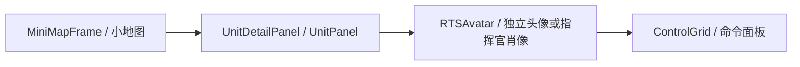
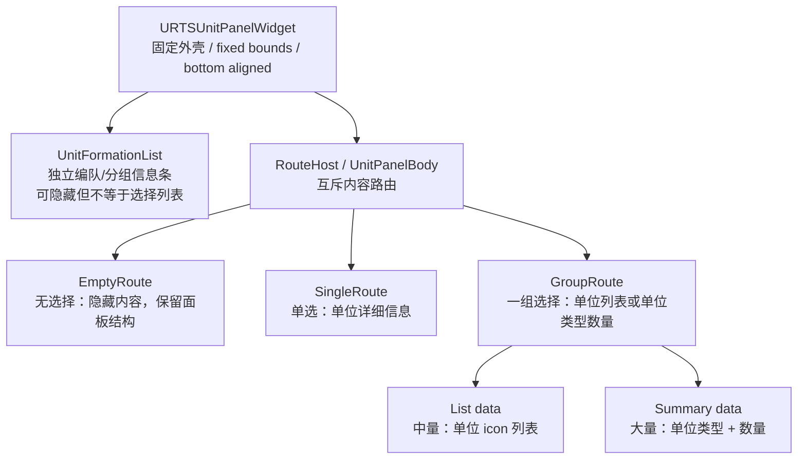
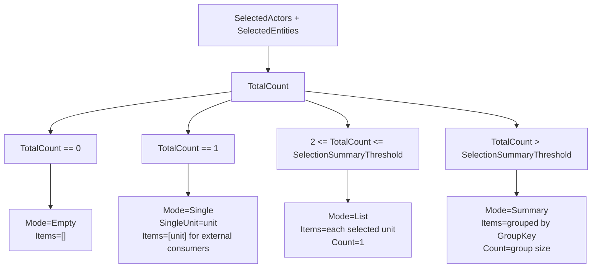
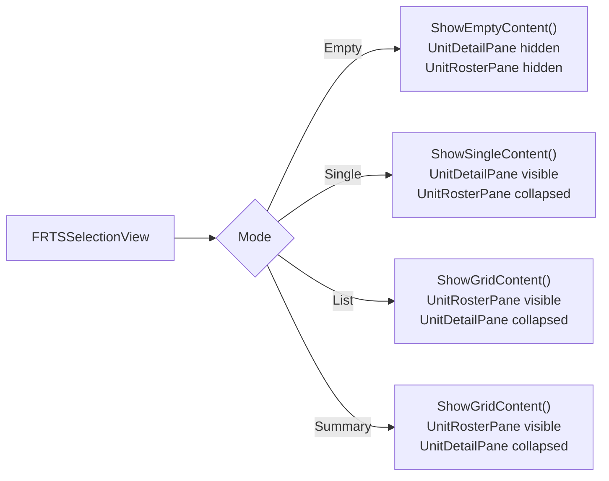
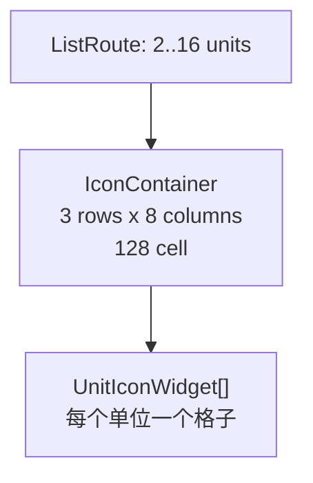
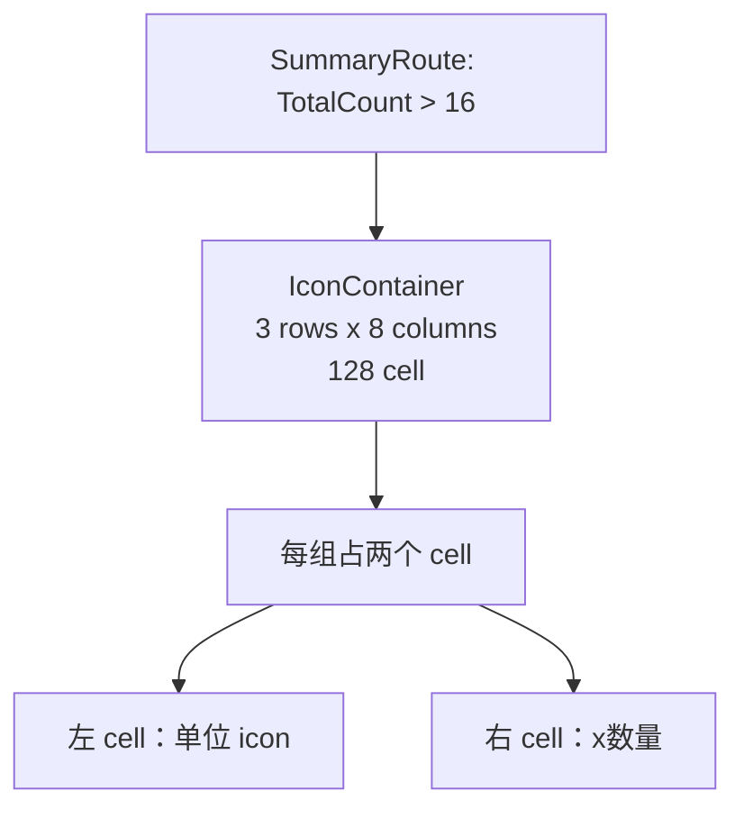
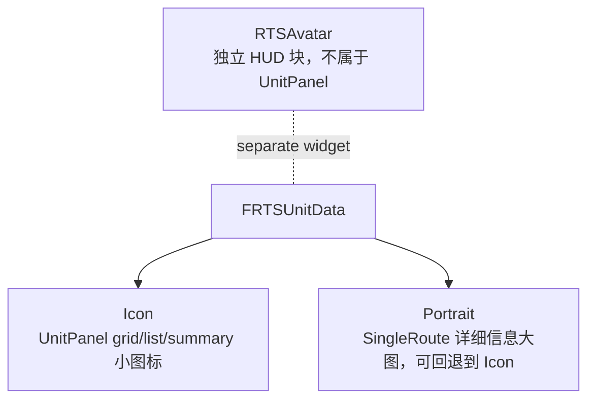
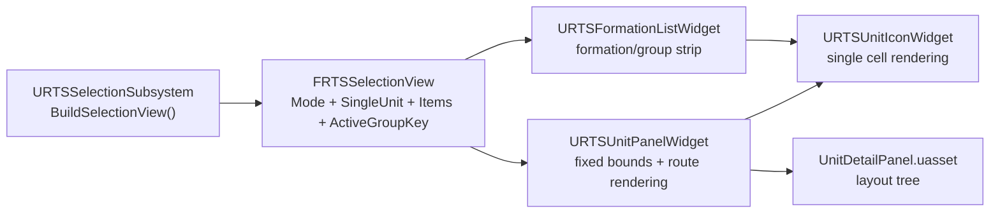

# RTS UnitPanel Architecture

这份图只定义 UnitPanel 架构边界，不定义具体美术样式。

## 1. HUD 横向主结构

星际式底部 HUD 不是一个大面板里硬塞所有东西，而是几个并列的大块。

边界：
- `UnitDetailPanel` 只负责 UnitPanel。
- `RTSAvatar` 是独立 HUD 块，不属于 UnitPanel 内部内容。
- `ControlGrid` 是命令面板，不属于 UnitPanel。
- `MiniMapFrame` 是小地图，不属于 UnitPanel。

## 2. UnitPanel 内部结构

UnitPanel 分两层：外壳和内容。外壳固定置底；内容按选择状态走互斥路由。

核心规则：
- UnitPanel 外壳是一个概念，UnitPanel 内容是另一个概念。
- `UnitFormationList` 是独立 widget，负责编队/分组信息，不属于单选详情，也不属于选择列表。
- `SingleRoute` 和 `GroupRoute` 是两个界面容器，互斥显示。
- `List` 和 `Summary` 是 `GroupRoute` 内的数据形态，不是第三个单独界面容器。
- 单选时不显示列表。
- 中量和大量时不显示单体详细信息。

## 3. 后端选择状态

后端只输出一个 `FRTSSelectionView`，前端按 `Mode` 选择路由。

配置项：
- `SelectionSummaryThreshold = 16`
- `SelectionGridRows = 3`
- `SelectionGridColumns = 8`
- `SelectionIconSize = 128`
- `SelectionPanelHeaderHeight = 44`
- `FormationListMaxSlots = 8`
- `FormationListIconSize = 32`
- `FormationListSlotGap = 4`

固定尺寸公式：
- `PanelWidth = SelectionGridColumns * SelectionIconSize + Padding.Left + Padding.Right`
- `PanelHeight = SelectionPanelHeaderHeight + SelectionGridRows * SelectionIconSize + Padding.Top + Padding.Bottom`
- 当前默认值：`Width = 8 * 128 + 16 + 16 = 1056`，`Height = 44 + 3 * 128 + 4 + 4 = 436`。

这里的固定是 UnitPanel 外壳固定；`SingleRoute`、`GroupRoute` 只是外壳内部的互斥内容，不反向决定外壳尺寸。`Items[0]` 可以继续给外部头像/样式消费者使用，但 UnitPanel 不用它把单选画成列表。

## 4. 前端路由映射

可见性规则：

| Route | UnitPanelFrame | UnitFormationList | UnitDetailPane | UnitRosterPane/IconContainer |
| --- | --- | --- | --- | --- |
| Empty | Visible | Optional/Hidden | Hidden | Hidden |
| Single | Visible | Optional | Visible | Collapsed |
| List | Visible | Optional | Collapsed | Visible |
| Summary | Visible | Optional | Collapsed | Visible |

`UnitFormationList` 隐藏或显示自己的内容，但不改变 UnitPanel 外壳尺寸。

## 5. 三种内容形态

### SingleRoute

注意：
- SingleRoute 不预设装备、武器、护甲、额外索引槽。
- 需要显示什么单体信息，由明确的数据字段和明确控件决定，不提前造空槽。

### ListRoute

规则：
- 直接显示每个被选单位的 icon。
- 空 cell `Hidden`，保留 grid 尺寸。

### SummaryRoute

规则：
- Summary 的 item 是 group，不是单个单位。
- group key 来自 `GroupKey`，数量来自 `Count`。
- 一个 summary group 占 2 个 cell。

## 6. icon / portrait / avatar 边界

规则：
- `Icon` 是 UnitPanel 内的单位图标。
- `Portrait` 是单选详细信息里可以使用的大图资源。
- `RTSAvatar` 是 HUD 横向主结构里的独立块。
- 不能因为单选显示详细信息，就把 UnitPanel 的 icon 概念删掉。
- 不能因为有 `RTSAvatar`，就把 UnitPanel 内部图标改成 avatar。

## 7. 代码责任边界

职责：
- `URTSSelectionSubsystem` 决定选择状态和数据形态。
- `FRTSSelectionView.Mode` 决定前端路由。
- `URTSUnitPanelWidget` 负责固定 UnitPanel 尺寸，并根据 route 控制单选详情/选择列表的可见性和填充数据。
- `URTSFormationListWidget` 负责 UnitPanel header 里的编队/分组信息条；它自己监听 `FRTSSelectionView`，不让 UnitPanel 主路由知道它内部怎么画。
- `URTSUnitIconWidget` 只负责一个格子的视觉。
- `UnitDetailPanel.uasset` 只负责结构和外观布局，不负责选择状态机。
